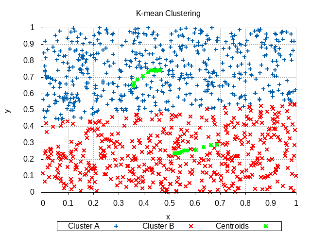
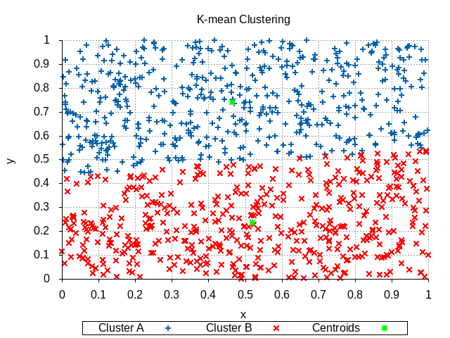

# cpsc479-project2

## MPI K-means Clustering

Group members:

Huy Ho hho114@csu.fullerton.edu

Chandler Ebrahimi csebra@csu.fullerton.edu

Darren Vu vuchampion@csu.fullerton.edu

## Requires library or packages

- [gnuplot](http://www.gnuplot.info/download.html)

- mpi or mpich

Note: This program was tested and compiled on Linux operation system

## Implement MPI

1. Create random data point numbers from 0 to 1, and assign partial number points to each processor. (MPI_Scatter)

2. Choose the first few data points as centroids and assign them to clusters.

3. In each processor for each data point choose the next one in the array tol make up one point based on dimension, for example 2 dimensions will be x and y. Then find it’s cluster by calculating it’s distance with centroids using the Euclidean distance formula. (MPI_bcast for centroid list and mean distance tracking if mean reach equally  among centroids)

4. Calculate the mean distance of each cluster which is also a new centroid, and update centroids for each cluster. (MPI_Reduce to get points distance from each process)

5. Repeat Step 3 until the number of iterations is greater than 10,000 or mean distance has changed less than 0, it means all centroids have equal distance to each other.

6. Label all points with it’s cluster and print the results

## How to use

Go to project directory, and use mpicc to compile the main.c file (mpicc main.c), then run the compile file with four input arguements.(mpirun -n "number process" a.out "k number or number of cluster" "number dimension" "number points"

For example:

```terminal

 mpicc main.c && mpirun -n 6 a.out 2 2 100

```

The program will print process of kmean algorithm change centroids and print the final result which show the point x y coordinates and centroid tag number.

For better understanding how k-mean work, we develop program to ouput image files which show how the centroids changes. However this will only work for 2 dimension and k number limit to 3.

## 2 Kmean Clustering 2 dimension with graph

Use this command to create kmean cluster with 2 clusters and 100 data points per process graph:
Standard: mpicc main.c && mpirun -n "number process" a.out 2 2 "number points" && gnuplot graphs/2_kmean_graph.gp

```terminal

 mpicc main.c && mpirun -n 10 a.out 2 2 1000 && gnuplot graphs/2_kmean_graph.gp

```

The output will look like this:

Changing centroids Process



Final centroid when finish



## 3 Kmean Clustering 2 dimension with graph

Use this command to create kmean cluster with 3 clusters and 100 data points per process graph:

Standard: mpicc main.c && mpirun -n "number process" a.out 3 2 "number point" && gnuplot graphs/3_kmean_graph.gp

```terminal

  mpicc main.c && mpirun -n 10 a.out 3 2 1000 && gnuplot graphs/3_kmean_graph.gp

```

The output will look like this:

Changing centroids Process


Final centroid when finish


### Shortcut command to run both method above

```terminal

make

```

### Convergence of k-means demonstrate


