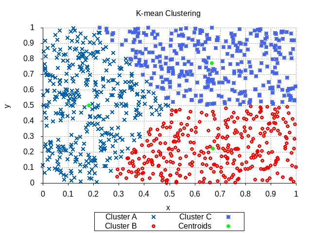

# cpsc479-project2

## MPI K-means Clustering

Group members:

Huy Ho hho114@csu.fullerton.edu

Chandler Ebrahimi csebra@csu.fullerton.edu

Darren Vu vuchampion@csu.fullerton.edu

## Requires library or packages

- [gnuplot](http://www.gnuplot.info/download.html)

- mpi or mpich

Note: This program was tested and compiled on Linux operation system

## How to use

Go to this project mpi_kmean_clustering directory, and use mpicc to compile the main.c file (mpicc main.c), then run the compile file with four input arguements.(mpirun -n "number process" a.out "k number or number of cluster" "number dimension" "total seed number"

For example:

```terminal

 mpicc main.c && mpirun -n 6 a.out 3 2 50

```

The program will print process of kmean algorithm change centroids and print the final result which show the seeds x y coordinates and centroid tag number.

For better understanding how k-mean work, we develop program to ouput image file which show how the centroids changes. However this will only work for 2 dimension and k number limit to 3.

*Note: Remember remove old data for new graph

```terminal

rm data/* images/*

```

## 2 Kmean Clustering

Use this command to create kmean cluster with 2 clusters and 100 seeds per cluster graph:

```terminal

 mpicc main.c && mpirun -n 6 a.out 2 2 100 && gnuplot 2_kmean_graphs.gp

```

Changing centroids Process


Final centroid when finish


## 3 Kmean Clustering

Use this command to create kmean cluster with 3 clusters and 100 seeds per cluster graph:

```terminal

  mpicc main.c && mpirun -n 6 a.out 3 2 100 && gnuplot 3_kmean_graphs.gp

```

Changing centroids Process


Final centroid when finish



## Time Consuming
